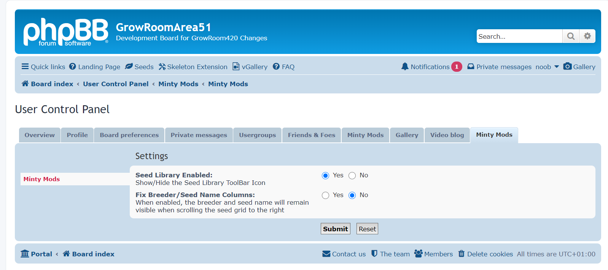
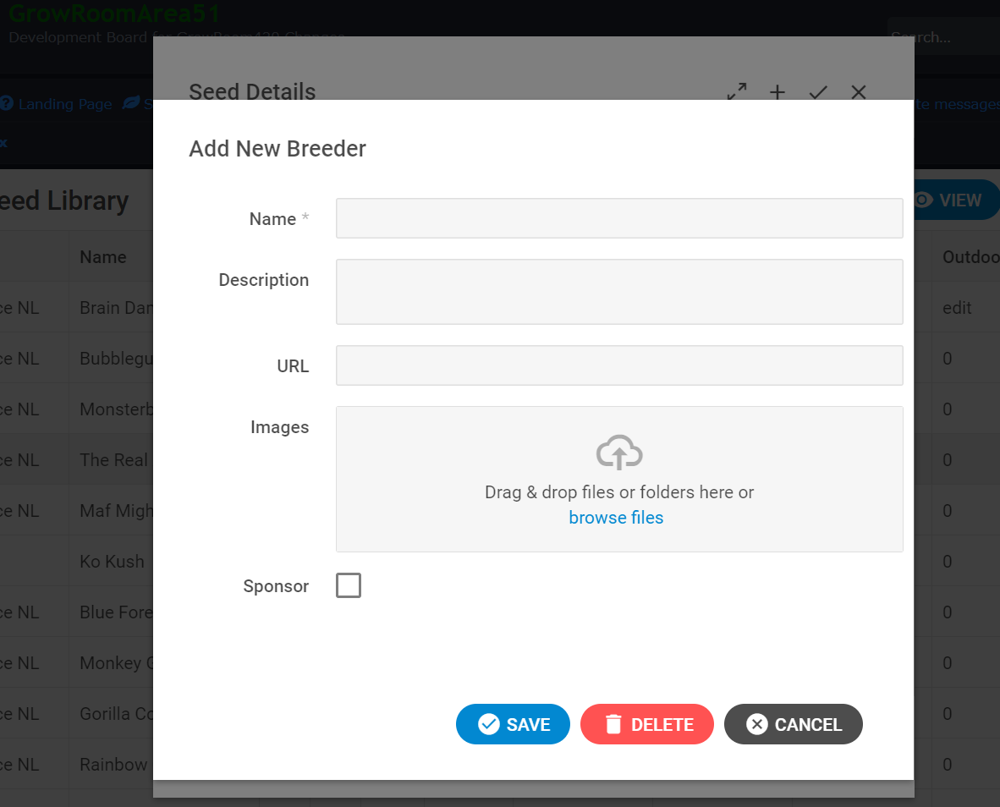

# 1. Minty Seed Library

## 1.1. Installation

Copy the extension to phpBB/ext/minty/seeds

NOTE: You will need to manually create the directory 'minty' within the ext directory then create a sub directory called 'seeds' within that, then copy in the contents of the extension. 

You should end up with the following directory structure:-

Go to "ACP" > "Customise" > "Extensions" and enable the "Minty Seed Library" extension.

Once enabled you should see the extensions listed:-

Go to "ACP" > "Extensions" and enable the "Minty Seed Library" toolbar icon and configure the PHPBB table prefix etc.

There are a number of configuration options available with the ACP panel as follows:-

Note: the Database prefix needs to the prefix used for the tables generated during installed. This is usually 'phpbb_' unless customised.

# Usage:

## Un-Registered Users View

No icon is visible to to un-registered users and the extension is effectively disabled:-

## Registered Users View

Registered users will see the 'Seeds' icon in the toolbar:-

But will be given the option to disable via the user control panel if required:-

Other options such as the 'Grid Split' are also available on per user basis.
Grid split allows the seed name and breeder to remain visible when scrolling right to view the seed data:-

Basic users without any additional permissions will just see a read only version of the grid, and double clicking will show read only details for the record:-:- 

Or selecting the context menu by right clicking will show the limited options available to them:-

## Data Entry

Adding new seed records - with the correct permission you should see the following options:-

both above the grid and when right clicking for a context sensitive menu:-

Selecting new will allow the entry of a new seed record:-

Selecting edit, or double clicking a row with the appropriate permissions will show the dialog in edit mode:-

## Tags

Tags are my way of allowing easy entry of data while still trying to keep some consistency for searching, spelling, etc.

The idea is that you can type anything which will be accepted as valid but will be offered when others are typing a similar term etc. The tags can contain anything including spaces etc:-

Once you are finished typing, pressing 'TAB' will create the tag:-

and make this available to others to select as a shortcut:-

Already 'selected' tags for the current record will show as highlighted to the left side:-

## Genetics

Genetics is a slightly different tag in that the parent must already exist within the database to be able to select a valid entry:-

Manual entry of this field is limited to picking other seeds:-

## Breeder 

@todo

## Image Upload

Single image upload by drag dropping or browsing to a directory location:-

Complete folder can be dropped to add all images within the directory

Images are uploading individually and can be removed before the record is saved.

## Points

Support has been integrated for [APS - Advanced Points System](https://github.com/phpBB-Studio/AdvancedPointsSystem) to allow forum points to be automatically granted when creating/editing records etc:-

## Permissions

Additional permissions can be granted on a per user basis to allow users to add records, edit records and delete records:-

These permissions can be extended for moderators to allow adding, editing and deleting of breeders:-

Admin permissions are automatically given to administrators but these can also be controlled:-

# 1.2. License

[GPLv2](license.txt)

